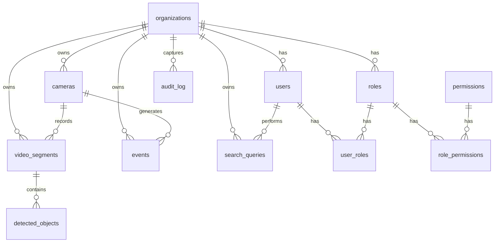

# VisionQuery AI - Database Schema Documentation

This document describes the PostgreSQL 16 database schema for VisionQuery AI, covering multi-tenancy, Row-Level Security, time-series events, and audit logging.

---

## Entity Relationship Diagram (ERD)



---

## Data Dictionary

### 1. `organizations`
Represents the customer organization / tenant. All transactional tables partition or filter by organization.
- **id** (`UUID`, PRIMARY KEY, NOT NULL): Unique organization identifier. Default: `gen_random_uuid()`.
- **name** (`VARCHAR(255)`, NOT NULL): Organization display name.
- **created_at** (`TIMESTAMPTZ`, NOT NULL): Record creation timestamp. Default: `NOW()`.
- **updated_at** (`TIMESTAMPTZ`, NOT NULL): Record last modification timestamp. Default: `NOW()`.
- **deleted_at** (`TIMESTAMPTZ`, NULLABLE): Soft delete timestamp.

### 2. `users`
System user accounts belonging to an organization.
- **id** (`UUID`, PRIMARY KEY, NOT NULL): Unique user identifier. Default: `gen_random_uuid()`.
- **org_id** (`UUID`, Foreign Key -> `organizations.id`, NOT NULL): Organization tenant ID.
- **email** (`VARCHAR(255)`, UNIQUE, NOT NULL): User email address.
- **hashed_password** (`VARCHAR(255)`, NOT NULL): Hashed user password.
- **is_active** (`BOOLEAN`, NOT NULL): User status. Default: `TRUE`.
- **created_at** (`TIMESTAMPTZ`, NOT NULL): Record creation timestamp.
- **updated_at** (`TIMESTAMPTZ`, NOT NULL): Record last modification timestamp.
- **deleted_at** (`TIMESTAMPTZ`, NULLABLE): Soft delete timestamp.

### 3. `roles`
RBAC user roles.
- **id** (`UUID`, PRIMARY KEY, NOT NULL): Unique role identifier. Default: `gen_random_uuid()`.
- **org_id** (`UUID`, Foreign Key -> `organizations.id`, NOT NULL): Tenant organization.
- **name** (`VARCHAR(100)`, NOT NULL): Role name (e.g. "Admin", "Operator").
- **description** (`TEXT`, NULLABLE): Role description.
- **created_at** (`TIMESTAMPTZ`, NOT NULL): Record creation timestamp.
- **updated_at** (`TIMESTAMPTZ`, NOT NULL): Record last modification timestamp.
- **deleted_at** (`TIMESTAMPTZ`, NULLABLE): Soft delete timestamp.
- *Unique constraint*: `(org_id, name)`

### 4. `permissions`
Global permission items defining application capabilities.
- **id** (`UUID`, PRIMARY KEY, NOT NULL): Unique permission identifier.
- **name** (`VARCHAR(100)`, UNIQUE, NOT NULL): Permission key (e.g., `camera:view`).
- **description** (`TEXT`, NULLABLE): Permission explanation.
- **created_at** (`TIMESTAMPTZ`, NOT NULL): Record creation timestamp.
- **updated_at** (`TIMESTAMPTZ`, NOT NULL): Record last modification timestamp.
- **deleted_at** (`TIMESTAMPTZ`, NULLABLE): Soft delete timestamp.

### 5. `user_roles`
Many-to-many relationship mapping Users to Roles.
- **user_id** (`UUID`, PK & FK -> `users.id`, NOT NULL): User identifier.
- **role_id** (`UUID`, PK & FK -> `roles.id`, NOT NULL): Role identifier.

### 6. `role_permissions`
Many-to-many relationship mapping Roles to Permissions.
- **role_id** (`UUID`, PK & FK -> `roles.id`, NOT NULL): Role identifier.
- **permission_id** (`UUID`, PK & FK -> `permissions.id`, NOT NULL): Permission identifier.

### 7. `cameras`
Camera details and connection strings.
- **id** (`UUID`, PRIMARY KEY, NOT NULL): Unique camera identifier. Default: `gen_random_uuid()`.
- **org_id** (`UUID`, Foreign Key -> `organizations.id`, NOT NULL): Tenant organization.
- **name** (`VARCHAR(255)`, NOT NULL): Camera name.
- **location** (`VARCHAR(255)`, NOT NULL): Physical location description.
- **rtsp_url** (`TEXT`, NOT NULL): Cryptographically encrypted RTSP URL connection string.
- **status** (`VARCHAR(50)`, NOT NULL): Operational status (e.g. `active`, `offline`, `error`). Default: `offline`.
- **created_at** (`TIMESTAMPTZ`, NOT NULL): Record creation timestamp.
- **updated_at** (`TIMESTAMPTZ`, NOT NULL): Record last modification timestamp.
- **deleted_at** (`TIMESTAMPTZ`, NULLABLE): Soft delete timestamp.

### 8. `video_segments`
Metadata for recorded video segments stored in S3. Range partitioned by month on `start_time`.
- **id** (`UUID`, Composite Primary Key, NOT NULL): Unique video segment identifier.
- **org_id** (`UUID`, Foreign Key -> `organizations.id`, NOT NULL): Tenant organization.
- **camera_id** (`UUID`, Foreign Key -> `cameras.id`, NOT NULL): Camera source ID.
- **s3_key** (`VARCHAR(512)`, NOT NULL): S3 storage path.
- **start_time** (`TIMESTAMPTZ`, Composite Primary Key, NOT NULL): Segment start time (used as range partition key).
- **end_time** (`TIMESTAMPTZ`, NOT NULL): Segment end time.
- **duration_ms** (`INTEGER`, NOT NULL): Segment duration in milliseconds.
- **fps** (`INTEGER`, NOT NULL): Frames per second.
- **resolution** (`VARCHAR(50)`, NOT NULL): Video resolution (e.g., `1920x1080`).
- **file_size_bytes** (`BIGINT`, NOT NULL): File size in bytes.
- **processing_status** (`VARCHAR(50)`, NOT NULL): AI pipeline processing status (e.g. `pending`, `completed`). Default: `pending`.
- **created_at** (`TIMESTAMPTZ`, NOT NULL): Record creation timestamp.
- **updated_at** (`TIMESTAMPTZ`, NOT NULL): Record last modification timestamp.
- **deleted_at** (`TIMESTAMPTZ`, NULLABLE): Soft delete timestamp.

### 9. `detected_objects`
Objects detected within video segments.
- **id** (`UUID`, PRIMARY KEY, NOT NULL): Unique inference identifier. Default: `gen_random_uuid()`.
- **org_id** (`UUID`, Foreign Key -> `organizations.id`, NOT NULL): Tenant organization.
- **segment_id** (`UUID`, NOT NULL): Parent segment ID.
- **segment_start_time** (`TIMESTAMPTZ`, NOT NULL): Start time of parent segment.
- **frame_number** (`INTEGER`, NOT NULL): Video frame number where object was detected.
- **timestamp_ms** (`INTEGER`, NOT NULL): Frame offset in milliseconds.
- **class_label** (`VARCHAR(100)`, NOT NULL): Object category (e.g. `person`, `car`).
- **confidence** (`DOUBLE PRECISION`, NOT NULL): Detection probability (0.0 to 1.0).
- **bbox_x** (`DOUBLE PRECISION`, NOT NULL): Bounding box X coordinate (normalized).
- **bbox_y** (`DOUBLE PRECISION`, NOT NULL): Bounding box Y coordinate (normalized).
- **bbox_w** (`DOUBLE PRECISION`, NOT NULL): Bounding box width (normalized).
- **bbox_h** (`DOUBLE PRECISION`, NOT NULL): Bounding box height (normalized).
- **track_id** (`INTEGER`, NULLABLE): Object tracking sequence identifier.
- **created_at** (`TIMESTAMPTZ`, NOT NULL): Record creation timestamp.
- **updated_at** (`TIMESTAMPTZ`, NOT NULL): Record last modification timestamp.
- **deleted_at** (`TIMESTAMPTZ`, NULLABLE): Soft delete timestamp.
- *Foreign Key Constraint*: `(segment_id, segment_start_time)` references `video_segments(id, start_time)` ON DELETE CASCADE.

### 10. `events`
Security and operational alerts. Managed as a TimescaleDB hypertable partitioned by `start_time`.
- **id** (`UUID`, Composite Primary Key, NOT NULL): Unique event identifier.
- **org_id** (`UUID`, Foreign Key -> `organizations.id`, NOT NULL): Tenant organization.
- **camera_id** (`UUID`, Foreign Key -> `cameras.id`, NOT NULL): Camera source ID.
- **event_type** (`VARCHAR(100)`, NOT NULL): Alert trigger category (e.g. `intrusion`).
- **severity** (`VARCHAR(50)`, NOT NULL): Alert severity (`info`, `warning`, `critical`). Default: `info`.
- **start_time** (`TIMESTAMPTZ`, Composite Primary Key, NOT NULL): Event timestamp (hypertable partition key).
- **end_time** (`TIMESTAMPTZ`, NOT NULL): Event resolution timestamp.
- **metadata** (`JSONB`, NOT NULL): Structured event payload. Enforced by CHECK constraint to require keys `source_type` and `confidence_threshold`.
- **thumbnail_s3_key** (`VARCHAR(512)`, NOT NULL): S3 path to event thumbnail image.
- **created_at** (`TIMESTAMPTZ`, NOT NULL): Record creation timestamp.
- **updated_at** (`TIMESTAMPTZ`, NOT NULL): Record last modification timestamp.
- **deleted_at** (`TIMESTAMPTZ`, NULLABLE): Soft delete timestamp.

### 11. `search_queries`
Logs of user natural language and vector searches.
- **id** (`UUID`, PRIMARY KEY, NOT NULL): Unique query log identifier. Default: `gen_random_uuid()`.
- **org_id** (`UUID`, Foreign Key -> `organizations.id`, NOT NULL): Tenant organization.
- **user_id** (`UUID`, Foreign Key -> `users.id`, NOT NULL): User who executed search.
- **query_text** (`TEXT`, NOT NULL): Search terms entered.
- **query_embedding** (`vector(512)`, NOT NULL): pgvector 512-dimensional query embedding vector.
- **results_count** (`INTEGER`, NOT NULL): Number of objects/segments matched.
- **latency_ms** (`INTEGER`, NOT NULL): Query latency in milliseconds.
- **created_at** (`TIMESTAMPTZ`, NOT NULL): Record creation timestamp.
- **updated_at** (`TIMESTAMPTZ`, NOT NULL): Record last modification timestamp.
- **deleted_at** (`TIMESTAMPTZ`, NULLABLE): Soft delete timestamp.

### 12. `audit_log`
Append-only log capturing all database DML (insert, update, delete) operations.
- **id** (`UUID`, PRIMARY KEY, NOT NULL): Unique log record identifier. Default: `gen_random_uuid()`.
- **org_id** (`UUID`, Foreign Key -> `organizations.id` ON DELETE SET NULL, NULLABLE): Tenant context.
- **table_name** (`VARCHAR(100)`, NOT NULL): Targeted database table.
- **action** (`VARCHAR(50)`, NOT NULL): Operation type (`INSERT`, `UPDATE`, `DELETE`).
- **old_data** (`JSONB`, NULLABLE): Row values before the operation. Enforced to be a JSON object if present.
- **new_data** (`JSONB`, NULLABLE): Row values after the operation. Enforced to be a JSON object if present.
- **query_text** (`TEXT`, NOT NULL): The exact SQL query executed.
- **user_id** (`UUID`, Foreign Key -> `users.id` ON DELETE SET NULL, NULLABLE): User context.
- **ip_address** (`VARCHAR(45)`, NULLABLE): Client IP address executing the command.
- **created_at** (`TIMESTAMPTZ`, NOT NULL): Log generation timestamp. Default: `NOW()`.

---

## Database Retention Policies

Enterprise data volumes require proactive chunk and partition management:

### 1. Video Segments and Detected Objects
- **Policy**: Keep active for 90 days.
- **Mechanism**: Dropping monthly table partitions. Because `detected_objects` has a foreign key to `video_segments` with `ON DELETE CASCADE`, dropping a video segment partition instantly purges all related detected objects without scanning the tables.
- **Command**:
  ```sql
  DROP TABLE IF EXISTS video_segments_2026_01;
  ```

### 2. Events (Alerts)
- **Policy**: Retain events for 1 year, then archive.
- **Mechanism**: Uses TimescaleDB's native data retention policy manager, which drops chunks representing old time windows automatically.
- **Command**:
  ```sql
  SELECT add_retention_policy('events', INTERVAL '1 year');
  ```

### 3. Search Queries
- **Policy**: Retain for 90 days.
- **Mechanism**: Routine cron or pg_cron job executing:
  ```sql
  DELETE FROM search_queries WHERE created_at < NOW() - INTERVAL '90 days';
  ```

### 4. Audit Log
- **Policy**: Permanent (Immutable, Append-Only).
- **Mechanism**: The `protect_audit_log` database trigger strictly prevents any update or delete operations on this table. Dropping the table or dropping audit rows will raise an exception.
